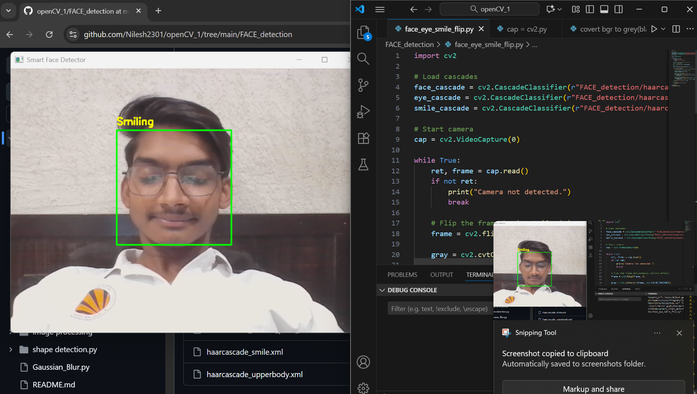

# 🎯 OpenCV Beginner Projects

This repository contains multiple mini OpenCV projects like:
✔ Image to Black & White  
✔ Face, Eye, and Smile Detection  
✔ Shape Detection  
✔ Blurring, Cropping, Text adding etc.

---

## ⚙️ Installatio

```bash
pip install opencv-python
pip install mediapipe          # If used


## 📌 Output of OpenCV Project

Here is one of the output images from my project:


